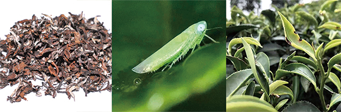
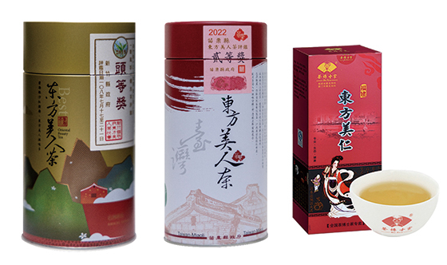

# Korea
## Hadong Green Tea
https://www.hadong.go.kr/01794/02469/01796.web

# Taiwan
대만 차는 그 뿌리가 중국 복건성에서 기원한다. 대만이 원래 복건성의 부속섬이었음을 감안하면 고개가 끄덕여진다. 복건성은 중국에서 청차를 주로 만들던 곳이다. 당연히 대만에서도 청차가 주로 만들어졌다. 그런데 대만에서는 청차 중에서도 청심오룡 같은 오룡차(오룡의 중국어 발음이 우롱이다)를 주로 재배했다. 중국이 세계 경제에 편입되기 이전 대만이 ‘우롱차’라는 이름으로 차를 전 세계에 수출했고, 그렇게 우롱차가 전 세계에 유명해졌다. 훗날 중국이 세계 무대에 나오면서 청차를 수출하려 보니 이미 전 세계에서 우롱차라는 이름이 위세를 떨치고 있었다. 중국은 “원래 청차다”라고 바로잡으려는 대신 우롱차라는 이름을 받아들인다. 그래서 지금까지 청차의 영어 표기가 ‘Blue tea’가 아닌 ‘Oolong tea’다.
## Oriental Beauty 東方美人
https://m.mk.co.kr/news/columnists/10793903
- 팽풍차라 불렸던 동방미인은 그런데 어떻게 ‘동방미인’이라는 근사한 이름을 얻게 됐을까. 영국 여왕이 이 차를 마시고 ‘동방의 미인 같은 차’라고 감탄해서 ‘동방미인’ 이름이 붙었다나. 대충 감탄사 조로 “Beautiful” 했을지도. 믿거나 말거나지만 어쨌든 동방의 미인 같은 차 ‘동방미인’은 오늘날 대만을 대표하는 차로 올라섰다.
- Originally, after Japan retreated from Taiwan after WWII, Taiwan mainly produced black tea because of high demand. But main producer switched to India (Assam tea), and most Taiwan tea producers turned to green tea. However a determined businesswoman takes on making oolong tea a signature of Taiwan in times when it only accounted for 2% of tea market. After bringing it to World Exhibition, it garnered world's attention and now oolong tea accounts for 17% of tea market.
- Though most Taiwan teas originate from China, Oriental Beauty is purely Taiwan origin.
- The history being: 보통 차는 봄에 만든다. 그런데 동방미인은 6월 중순 이후~7월 초에 여름차를 만든다. 대만 신죽지역의 한 농부가 게으름을 피우다 차밭에 농약 뿌리는 시기를 놓쳤다. 어느 날 밭에 나가보니, 아뿔싸~ 차밭에 웬 연두색 벌레가 잔뜩 끼어 찻잎을 갉아먹고 있는 게 아닌가. 여기저기 벌레 먹힌 찻잎으로 차를 만들 수는 없는 일. 그런데 이상하게도 찻잎에서 뭔가 좋은 향이 났다. 1년 농사를 망치게 생긴 농부는 한숨을 쉬다 일단 그 찻잎으로 차를 만들었다. 꽤 좋은 향과 맛이 났지만 벌레 먹은 찻잎으로 만든 차를 팔 자신이 도무지 없었던 농부는, 자기를 아는 사람이 없는 먼 곳에 차를 팔러 갔다. 그런데 이게 웬일. 차향이 너무 좋다는 평을 들으면서 평소 그가 팔던 차 가격보다 훨씬 비싼 가격에 차가 모두 팔려나갔다. 함박 웃음꽃을 피우며 돌아온 농부가 이 얘기를 하자 모두들 비웃었다. “허풍이 세다”며 심지어 그 차를 ‘허풍차’라 불렀다. 동방미인의 맨 처음 이름이 그래서 ‘팽풍차(팽풍은 허풍이라는 뜻)’다. 그런데 몇 달 뒤 낯선 사람들이 찾아와 “그 향기 좋은 차를 다시 만들어주면 만들어주는 만큼 다 비싼 값에 사겠다”고 하는 게 아닌가. 그때부터 차농들이 앞다퉈 동방미인을 만들기 시작했다는 스토리가 전해 내려온다.
- 그런데 벌레 먹힌 찻잎으로 만든 차가 어떻게 그렇게 기가 막힌 향을 내는 걸까. 동방미인의 비결은 ‘소록엽선’이라 불리는 벌레에 있다. 소록엽선이 찻잎을 갉아먹으면 찻잎은 달달한 향이 마구 뿜어져 나오는 물질을 대량으로 만들어낸다. 과거에는 그 메커니즘을 몰랐는데 최근 밝혀진 바에 따르면 그 물질은 바로 소록엽선의 천적인 흰눈썹껑충거미를 불러들이는 것으로 알려졌다. 이 지점에서 짐작해볼 수 있는 ‘팁’이 하나 있다. 예전엔 벌레가 끼지 않게 하기 위해 농약을 쳤지만, 동방미인은 벌레에 먹혀야 하기 때문에 농약을 치지 않는다. 적어도 제대로 된 동방미인 차는 농약 걱정 없이 편하게 마실 수 있다는 의미다. 

‘동방미인’차는 ‘소록엽선(가운데 사진)’이라는 벌레가 먹은 찻잎으로 만든다. 벌레 먹은 잎으로 만들기 때문에 완성된 차의 색상이 얼룩덜룩하다(왼쪽).
- 처음에 ‘팽풍차’라 불렸던 동방미인은 다양한 이름을 갖고있다. 어린잎으로 만드는 동방미인은 찻잎에 하얀 털이 많이 붙어 있다.‘백호(白毫)’라 불리는 하얀 털은 어린잎의 특징이다. 그래서 ‘백호오룡’이라고도 불린다. 잘 만든 동방미인은 갈색, 녹색, 붉은색, 흰색, 검은색 5가지 색깔의 찻잎이 모두 들어 있다 해서 ‘오색차’라는 이름도 붙었다. 샴페인 향과 맛이 난다 해서 ‘향빈우롱(향빈은 중국어로 샴페인이라는 의미)’이라고도 한다. 워낙 달달한 맛이 난다 해서 ‘蜜(꿀 밀)’ 자를 붙여 ‘밀향오룡’이라고도 부른다.
- On quality and pricing: ‘동방미인’이 대만 차를 이끄는 대표상품인 만큼 대만의 동방미인 품질을 유지하고 더 잘 만들기 위한 노력은 상상을 초월한다.(게다가 대만에서는 차 산업이 반도체에 이은 주요한 산업이다.) 대만에서 많은 차가 시합이라는 의미의 ‘비새’ 과정을 거쳐 등급이 매겨지고 그 등급에 따라 가격이 달려진다. 동방미인도 마찬가지다. 7월 초까지 만들어진 각 다원의 동방미인은 7월 말~8월 초 쯤 비새에서 품질을 겨룬다. 출품된 차 중 2~2.5%가 최고 등급인 ‘두등장’에 선정된다. 8~10%는 이등장, 17%까지 삼등장 라벨을 달 수 있다. 그다음 50%까지에는 ‘우량장’이라 표기할 수 있는 권한을 주는데 우량장을 또 세 등급으로 나눠 매화 1개, 2개, 3개로 구분한다(매화는 대만의 국화). 매화 3개가 제일 높은 등급이고 2개, 1개 순이다. 가격은 철저하게 등급에 따라 달라진다.
- 최고 등급 두등장도 다 같은 두등장이 아니다. 두등장 중 최고점을 받은 11개 차에 순서대로 특등장부터 두등장 1~10까지 번호가 매겨진다. 그리고 나머지 차는 그냥 뭉뚱그려 두등장이다. 특등장은 물론 두등장 1~10은 주로 러시아와 중국 부호들이 엄청난 가격에 구입해가는 것으로 알려졌다. 일반인이 그나마 접근할 수 있는 최고 좋은 차는 나머지 두등장인 셈이다. 대만에서 동방미인의 주요 산지는 신죽, 묘율, 도원 등 세 곳인데 그중 가장 유명한 신죽의 동방미인 두등장 75g의 대만 현지 가격이 50만원 선이다

대만에서 동방미인 산지는 ‘신죽’ ‘묘율’ ‘도원’이 대표적이다. 왼쪽이 ‘신죽’, 가운데가 ‘묘율’ 동방미인. 오른쪽은 중국의 짝퉁차 ‘東方美仁’.
## Wen Shan Pou Chong 文山包種茶
